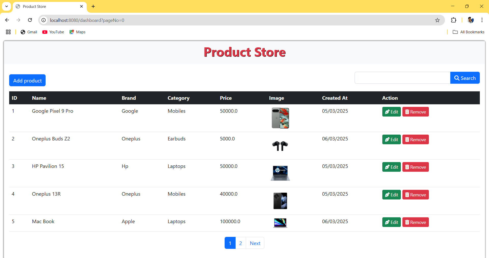
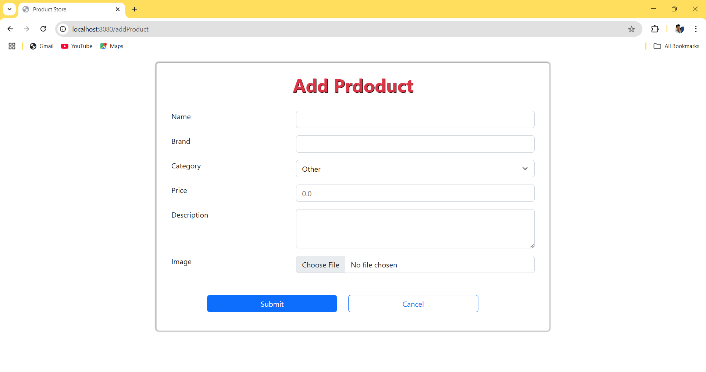
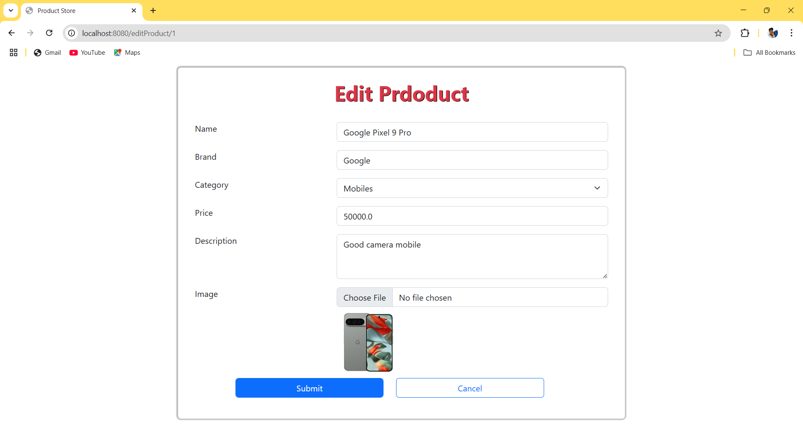
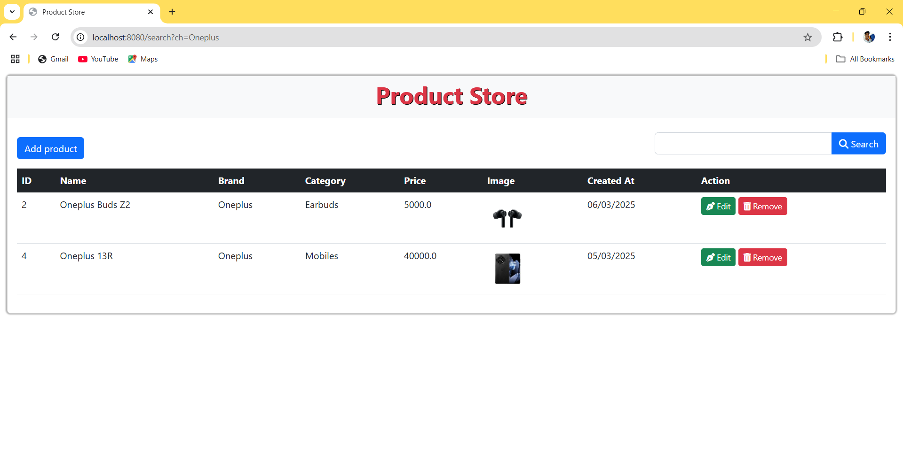
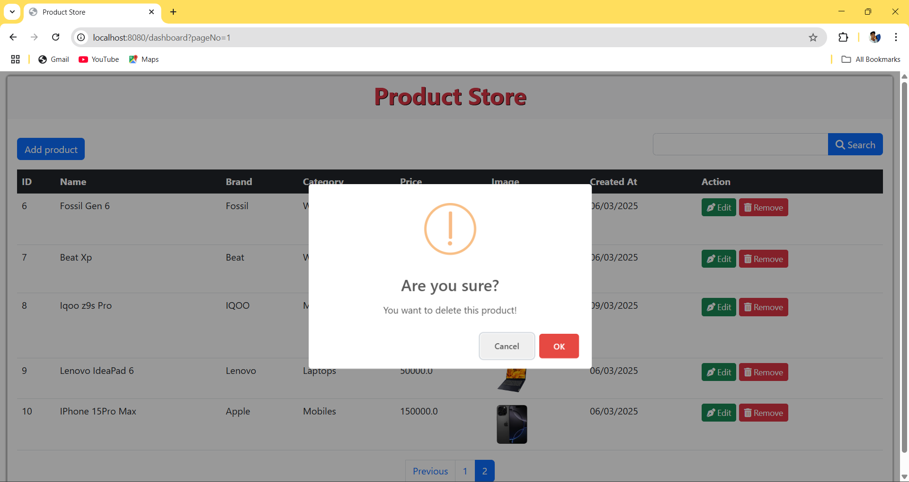

# 🛍️ Product Management System

    

## 📌 Project Overview
The **Product Management System** is a web-based application designed to help users manage products efficiently. It provides CRUD (Create, Read, Update, Delete) functionalities, enabling users to add, view, update, and delete product records.

This project is developed using **Spring Boot, Spring MVC, Spring Data JPA, HTML, CSS, JavaScript, and MySQL**.

## 📂 Project Architecture
- **🌐 Controller Layer**: Handles user requests and responses.
- **⚙️ Service Layer**: Contains the business logic.
- **💾 Repository Layer**: Interacts with the database and performs CRUD operations.
- **🗄️ Model Layer**: Defines entity classes used for creating tables in the database.

## ✨ Features
- ✅ **Add Product** - Users can add new products with details such as name, price, description, and category.
- ✅ **View Products** - Displays a list of all available products with relevant details.
- ✅ **Search Products** - Allows users to filter products based on name, category, or price range.
- ✅ **Edit Products** - Enables modification of existing product details.
- ✅ **Delete Products** - Users can remove unwanted products from the system.

## 🛠️ Technologies Used
| Category  | Technologies |
|-----------|-------------|
| **Backend** | Spring Boot, Spring MVC, Spring Data JPA |
| **Frontend** | HTML, CSS, JavaScript |
| **Database** | MySQL |

## 🚀 How to Run the Project
### 1️⃣ Prerequisites
- Install **Java 8+**
- Install **MySQL** and create a database
- Install **Maven**
- Install an **IDE** like IntelliJ IDEA or Eclipse

### 2️⃣ Clone the Repository
```sh
git clone https://github.com/your-repo-url.git
cd product-management-system
```

### 3️⃣ Configure Database
```properties
spring.datasource.url=jdbc:mysql://localhost:3306/product_db
spring.datasource.username=root
spring.datasource.password=yourpassword
spring.jpa.hibernate.ddl-auto=update
```

### 4️⃣ Run the Application
```sh
mvn spring-boot:run
```

### 5️⃣ Access the Application
```sh
http://localhost:8080
```

## 📸 Screenshots
### 📌 Dasbboard Page


### 📌 Add Product Page


### 📌 Edit Product Page


### 📌 Search Product


### 📌 Delete Product Page

<hr>

<h4 align="center"> 💡 Developed with ❤️ using Spring Boot & MySQL </h4>


